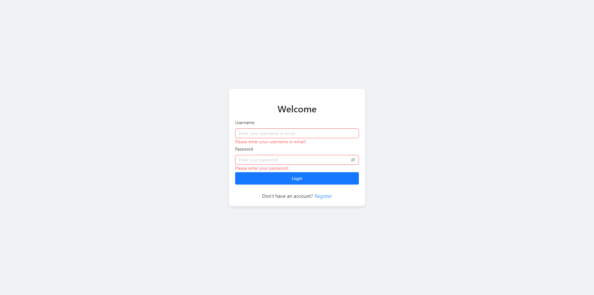
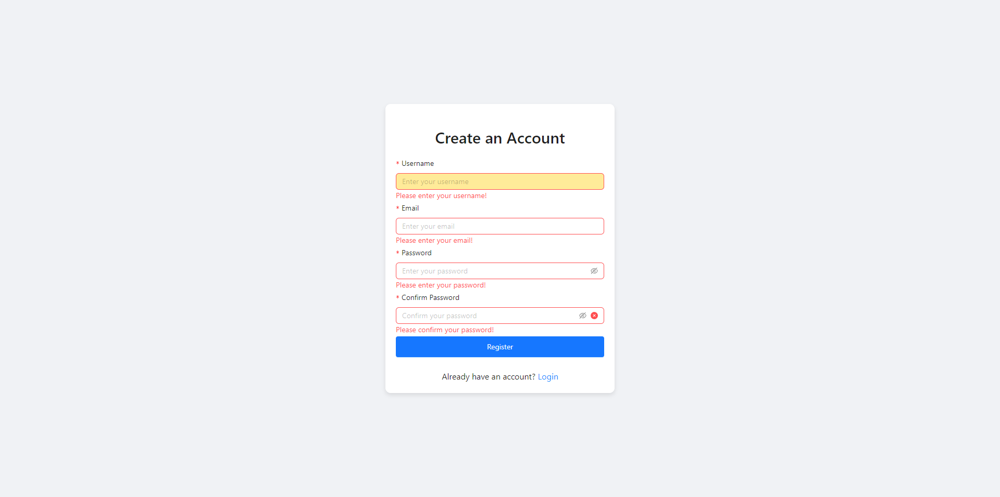
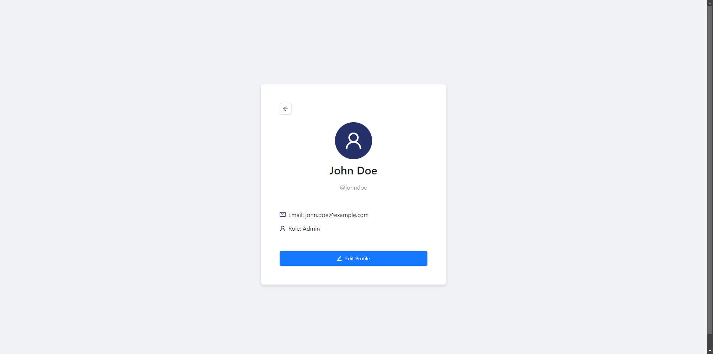
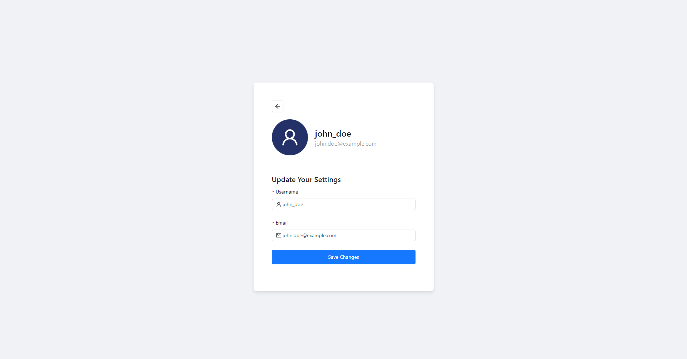
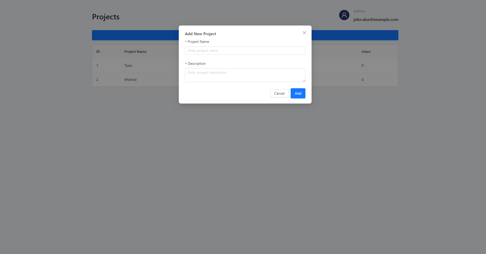
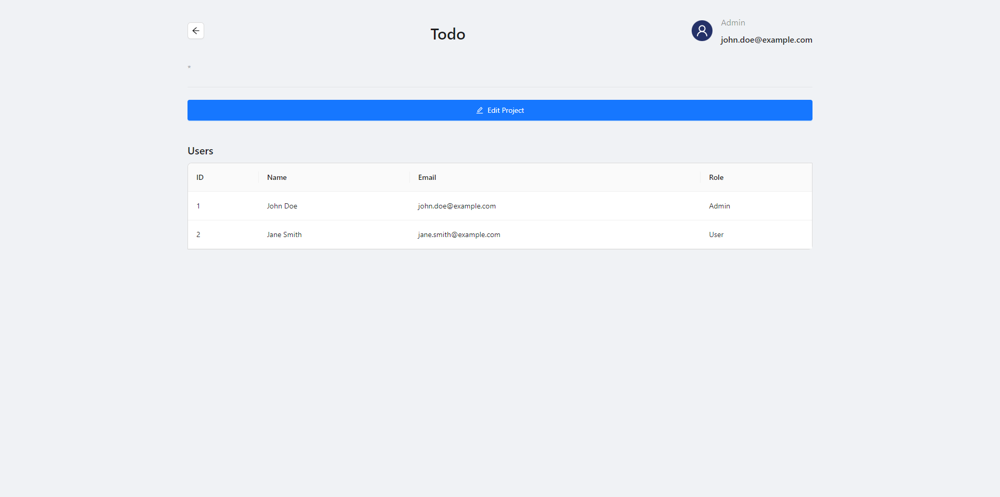
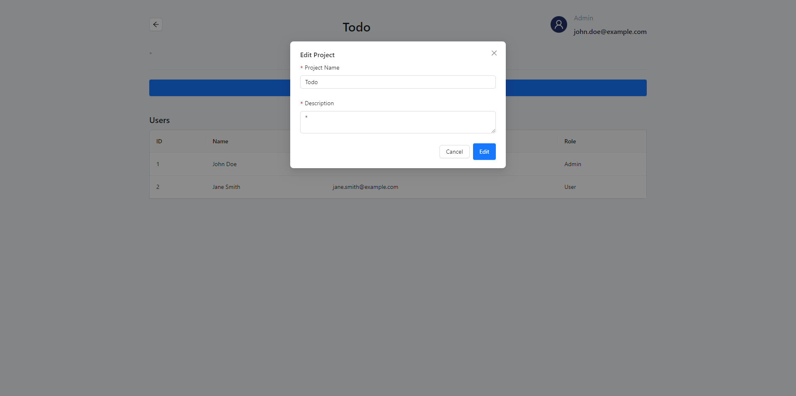

# Web Application

This is the frontend of the OAuth Integration Service.

## Features

- OAuth Integration
- User Management Dashboard
- Project Configuration

## Links

- [Description and instruction](frontend/README.md);
- [Minimal requirements](<Minimal requirements.md>);

## Screenshots

.png)

